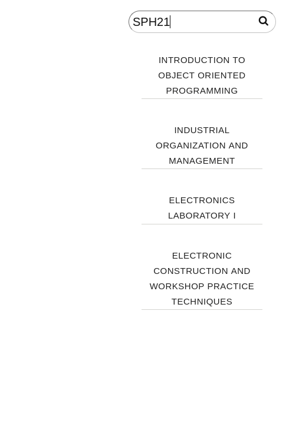

# react-search-bar
a self contained search system in react,
#### To use ,add the components to your react project
##### The search system use s a custom hook that gets a searchterm,a data source,a setState function to store the results,a category in the data to filter by and the min characters typed to start searching.
## useSearch hook
#### useSearch(searchTerm:STRING,source:ARRAY,setResults:FUNCTION,category:STRING,min:INTEGER)

#### the Search component needs one prop to work which is the data source
There are two components inside the mainSearch component,searchbar and results.
they are  displayed in a flex container that you can position anywhere you want by changing the imlementation of the css class ".search container" inside search.css 

### how it looks

### when searching

you can easily integrate it into your react project,if you experience any issues feel free to contact me